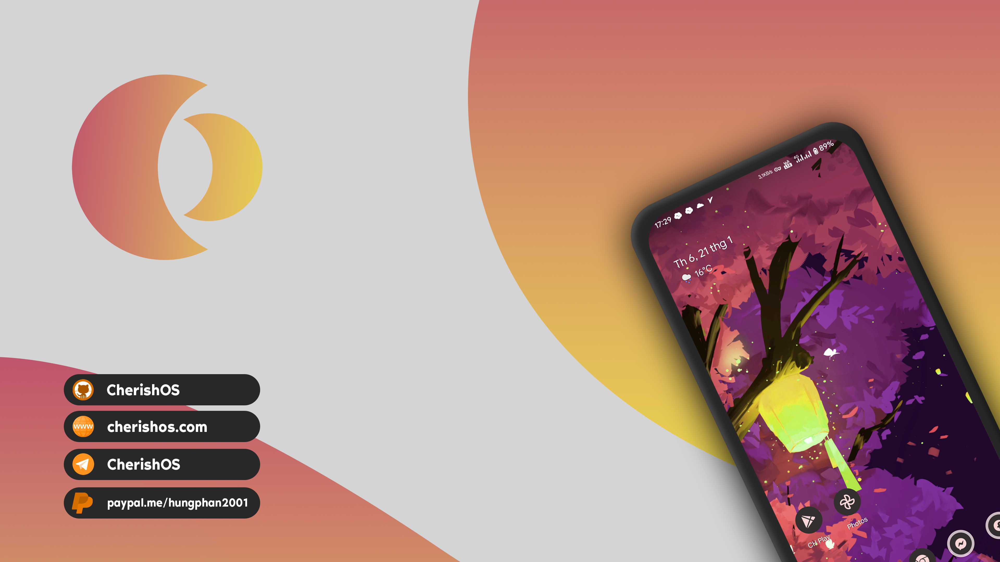

# <b> <i> CherishOS | Built with </i>💖

Credits:
=======
 * [**AOSP**](https://android.googlesource.com)
 * [**Crdroid**](https://github.com/crdroidandroid)
 * [**LineageOS**](https://github.com/LineageOS)
 * [**Evolution-X**](https://github.com/Evolution-X)
 * [**RisingTechOSS**](https://github.com/RisingTechOSS)
 * [**PixelExperience**](https://github.com/PixelExperience)

And other ROMs 
----------------------------------------------------------------------------

Getting Started:
==============

To get started with the building process, you'll need to get familiar with [Git and Repo](http://source.android.com/source/using-repo.html).

Install the build packages:
===============

Install JDK 8:

```bash
 sudo apt install openjdk-8-jdk
```

Tested on Ubuntu 16.04,16.10,17.04,18.04,18.10,19.04,21.04:

```bash
 sudo apt install bc bison build-essential ccache curl flex g++-multilib gcc-multilib git gnupg gperf imagemagick lib32ncurses5-dev lib32readline-dev lib32z1-dev liblz4-tool libncurses5-dev libsdl1.2-dev libssl-dev libwxgtk3.0-dev libxml2 libxml2-utils lzop pngcrush rsync schedtool squashfs-tools xsltproc zip zlib1g-dev
```
Tested on Ubuntu 20.04 
```bash 
     sudo apt install bc bison build-essential ccache curl flex g++-multilib gcc-multilib git gnupg gperf imagemagick lib32ncurses5-dev lib32readline-dev lib32z1-dev liblz4-tool libncurses5-dev libncurses5 libsdl1.2-dev libssl-dev libwxgtk3.0-gtk3-dev libxml2 libxml2-utils lzop pngcrush rsync schedtool squashfs-tools xsltproc zip zlib1g-dev
```
### Getting the source
- Making required directories
- Obtaining the repo binary
- Adding repo binary to your path
- Giving the repo binary proper permissions
- Initializing an empty repo
- Syncing the repo

Alright, so now we’re getting there. I have outlined the basics of what we’re about to do and broke them down as I know them. This is all pretty much going to be copy/paste so it’ll be fairly difficult to screw this up :)

##### Make directory for the repo binary
```bash 
     mkdir ~/bin
```
##### Add directory for the repo binary to its path
```bash 
     PATH=~/bin:$PATH
```
##### Downloading repo binary and placing it in the proper directory

 ```bash 
 curl http://commondatastorage.googleapis.com/git-repo-downloads/repo > ~/bin/repo
 ```

##### Giving the repo binary the proper permissions
```bash 
    chmod a+x ~/bin/repo
 ```     
To initialize your local repository, use a command like this:

```bash
    repo init -u https://github.com/CherishOS/android_manifest.git -b uqpr2
```

Then to sync up:
================

```bash
    repo sync -c -j$(nproc --all) --force-sync --no-clone-bundle --no-tags
```
Compilation of Cherish OS:
====================

From root directory of Project, perform following commands in terminal


```bash
. build/envsetup.sh
 brunch device-codename
```
 -----------------------------------------------------------------------------

Important for Smart Pixel AOD
====================
 
### Add it in overlay/frameworks/base/core/res/res/values/config.xml
```bash
<!-- Whether the device supports Smart Pixels -->
<bool name="config_supportSmartPixels">true</bool>
```

Important for some devices
====================
 
### Also set this flag in device tree cherish_device.mk 
```bash
    # FOD animations
    EXTRA_UDFPS_ANIMATIONS := true
```

### Add it in overlay/frameworks/base/core/res/res/values/config.xml 
```bash
<!-- Whether to show min/max refresh rate in display settings -->
    <bool name="config_show_refresh_rate_controls">true</bool>
    <bool name="config_supports_dynamic_refresh_rate_controls">true</bool>
```

### Night Light FOD
```bash
<!-- Night Light FOD -->
    <bool name="disable_fod_night_light">true</bool>
```
 
### Pocket Lock
```bash
<!-- Pocket Lock -->
    <bool name="config_pocketModeSupported">true</bool>
```

Battery Health
====================
### Add overlay/packages/apps/Settings/res/values/config.xml
```bash
<!-- Battery health -->
    <bool name="config_supportBatteryHealth">true</bool>
    <string name="config_batteryCalculatedCapacity">/sys/class/power_supply/bms/charge_full</string>
    <string name="config_batteryDesignCapacity">/sys/class/power_supply/bms/charge_full_design</string>
    <string name="config_batteryChargeCycles">/sys/class/power_supply/bms/cycle_count</string>
```

### Add sepolicy/vendor/system_app.te
```bash
# allow system apps to read battery status
r_dir_file(system_app, sysfs_battery_supply)
```
-----------------------------------------------------------------------------

Apply for Official Maintainership
====================
You can apply for officialy maintaining the ROM for your device.

https://forms.gle/BWg1mPxHNv2W8eK79

### <b> <i> XDA Template </i> ###
[Template](assets/xda.md)
